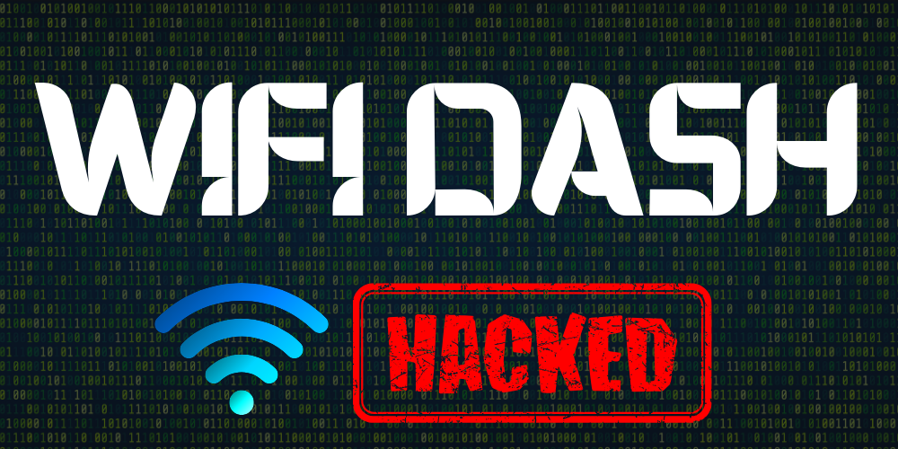

<p align="center">
  
</p>

<p align="center">
  
  
  
  
  
</p>

<p align="center">
  
  
  
  
  <a href="https://github.com/msnolix" target="_blank"></a>
</p>

# WiFiDash 🚀
A **professional terminal Wi-Fi dashboard** for Linux to scan, capture WPA/WPA2 handshakes, and test your networks ethically and securely.

⚠️ **Important:** Only use WiFiDash on networks you own. Unauthorized access is illegal.

---

## Table of Contents

1. [Features](#features)  
2. [Requirements](#requirements)  
3. [Installation](#installation)  
4. [Usage](#usage)  
5. [Manual Monitor Mode](#manual-monitor-mode-optional-⚡)  
6. [Configuration](#configuration)  
7. [Directory Structure](#directory-structure)  
8. [Contributing](#contributing)  
9. [License](#license)  

---

## Features 🌟

- Detect nearby Wi-Fi networks (signal strength, channel, ESSID)  
- Automatically select the strongest network  
- Capture WPA/WPA2 handshakes automatically  
- Brute-force handshakes with custom wordlists  
- Real-time terminal dashboard for monitoring progress  
- Logs all activities for auditing  
- Written entirely in Bash for easy modification and customization  

---

## Requirements 🛡️

- Linux OS (Kali, Ubuntu recommended)  
- Root privileges  
- `aircrack-ng` suite  
- Wi-Fi adapter supporting monitor mode  

**Install dependencies:**

```bash
sudo apt update
sudo apt install aircrack-ng
```

---

## Installation 🛠️

1. Clone the repository:

```bash
git clone https://github.com/msnolix/WiFiDash.git
cd WiFiDash
```

2. Make the script executable:

```bash
chmod +x wifi_dash.sh
```

---

## Usage ▶️

Run the script:

```bash
sudo ./wifi_dash.sh
```

Follow the interactive prompts to select your adapter, scan networks, capture handshakes, and perform brute-force tests safely.

---

## Manual Monitor Mode (Optional) ⚡

**Method 1: Using `ifconfig` and `airmon-ng`**

```bash
ifconfig wlan0 down
airmon-ng check kill
ifconfig wlan0 mode monitor
ifconfig wlan0 up
iwconfig
```

**Method 2: Using `airmon-ng start`**

```bash
ifconfig wlan0 down
airmon-ng check kill
airmon-ng start wlan0
iwconfig
```

> ⚠️ Replace `wlan0` with your Wi-Fi adapter. Only use on networks you own.

---

## Configuration ⚙️

- **captures/** – stores `.cap` handshake files  
- **logs/** – stores activity logs  
- **tmp/** – stores temporary scan files  

---

## Directory Structure 📂

```
WiFiDash/
├── wifi_dash.sh
├── captures/
├── logs/
├── tmp/
├── docs/
└── README.md
```

---

## Contributing 🤝

Contributions are welcome! To contribute:

1. Fork the repository  
2. Create a new branch for changes  
3. Test thoroughly on your own network  
4. Submit a Pull Request (PR)  

---

## License 📄

WiFiDash is licensed under the **GNU General Public License v3.0 (GPLv3)**. You are free to use, modify, and redistribute it under the same license, provided that you comply with GPL terms.

---

<p align="center">
Made with ❤️ by [msnolix](https://msnolix.com) | <a href="https://github.com/msnolix" target="_blank">GitHub</a>
</p>
